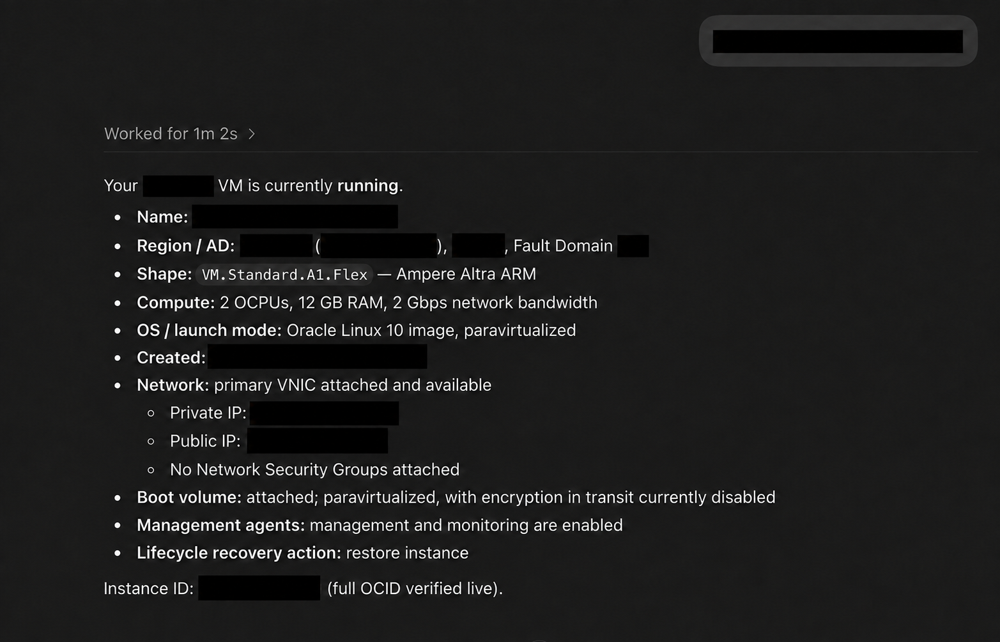
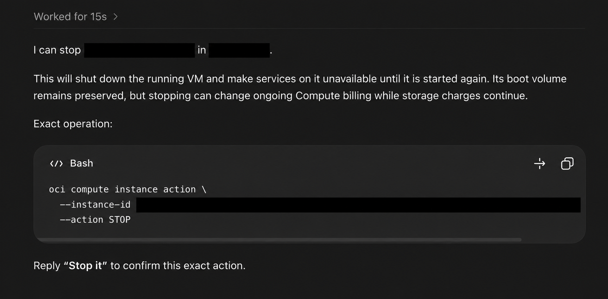
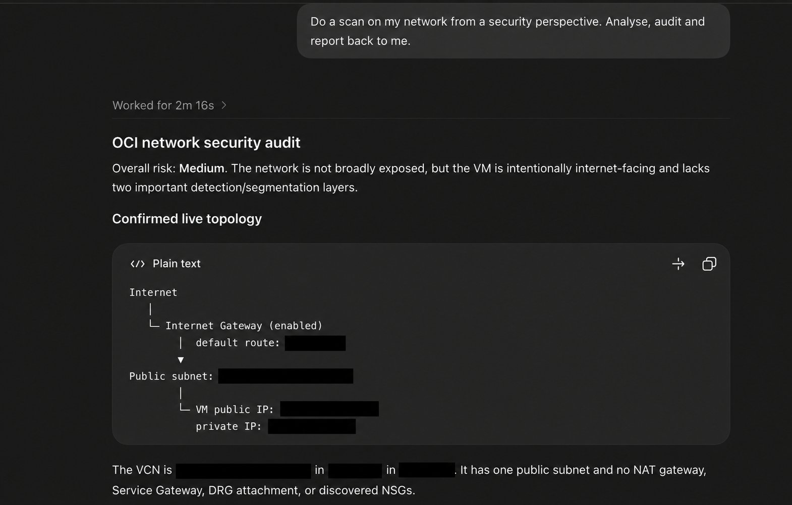
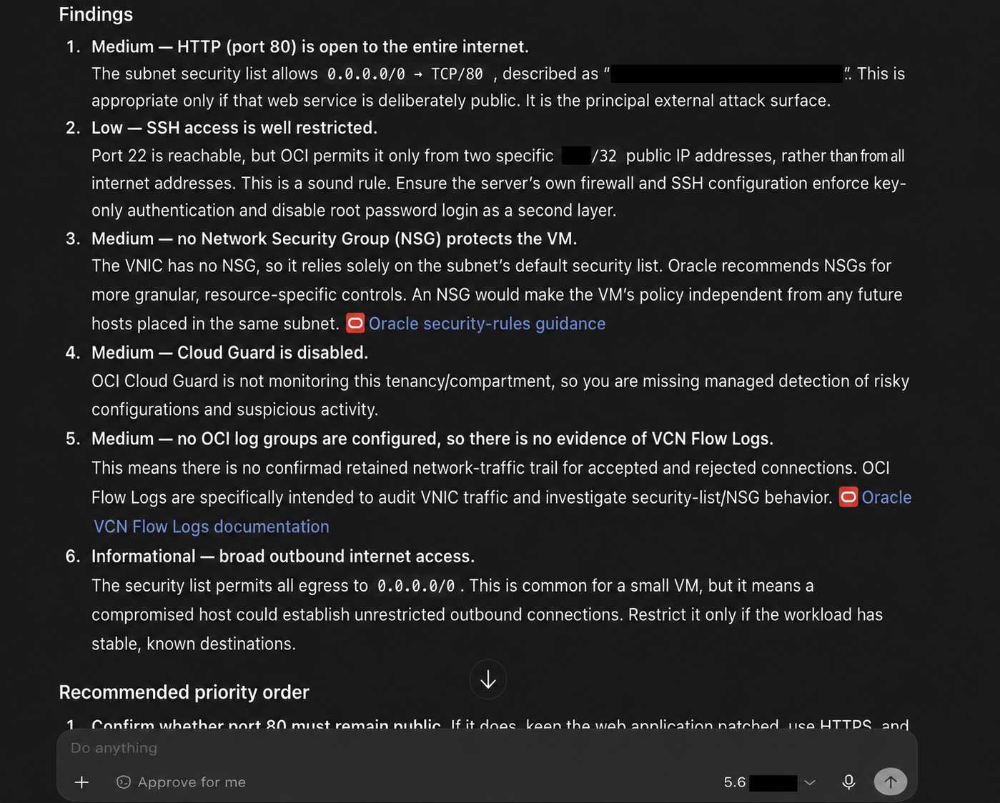

# OCI CLI Operations MCP (Codex)

> An unofficial, local-first OCI operations MCP and Codex skill set for safe
> tenancy discovery, troubleshooting, configuration planning, verification, and
> documentation-guided decisions.

This project is not affiliated with, endorsed by, or supported by Oracle.
Oracle Cloud Infrastructure, OCI, and related marks belong to Oracle and/or
its affiliates.

## What it is

OCI CLI Operations MCP is a local MCP server that uses **your existing
OCI CLI profile** on **your own machine**. It gives Codex structured OCI data
instead of requiring long, fragile command-line exchanges. It also includes two
Codex skills:

- `oci-tenancy` routes live OCI discovery, plans, approvals, changes, and
  verification.
- `oci-docs` selectively consults current official Oracle documentation on
  `docs.oracle.com` for risky, ambiguous, or service-specific decisions.

It does not host your OCI credentials, proxy your tenancy through a third
party, or include a cloud account. Authentication remains local in the OCI CLI
configuration you already control.

### Portable core, Codex-first experience

The server is a standard local stdio MCP implementation and can be adapted for
another MCP-compatible client. This repository is named **(Codex)** because its
packaging, skills, routing guidance, and installation path are designed for
Codex. The OCI CLI remains the underlying universal interface.

## Why use it instead of typing OCI CLI commands all day?

The OCI CLI is powerful and remains this project's universal fallback. But it
is verbose, its output is often far larger than the question requires, and a
single missing scope, region, IAM permission, or lifecycle check can lead to
the wrong conclusion.

This MCP preserves the CLI's breadth while adding an operations layer:

- compact typed inventory for tenancy, Compute, VCNs, Autonomous Database, or 
  any other OCI product/feature
- `oci_scope_discovery` for regions, availability domains, and compartments;
- `oci_batch_read` for up to eight focused read-only CLI requests across any
  OCI product family;
- structured results with command, exit code, duration, stderr, parsed data,
  truncation state, and an explicit failure for misleading empty output;
- redaction of credential-like response fields;
- exact-command mutation planning and approval tokens;
- focused post-change verification;
- a documentation-aware troubleshooting workflow, rather than stale embedded
  product knowledge.

In short: use ordinary CLI when you want to compose a command manually. Use
this MCP when you want Codex to investigate, explain, plan, and verify with a
clear safety boundary.

## Not read-only: controlled OCI command execution

This is not merely a read-only OCI CLI viewer. Read-only discovery is the
default because it is the right starting point for troubleshooting, inventory,
and health checks, but the MCP can also execute valid OCI CLI mutations against
resources that the configured local profile is authorised to manage.

That includes lifecycle and configuration work such as creating, starting,
stopping, rebooting, updating, and deleting resources across OCI services. For
example, Codex can plan a Compute start/stop action, create or update a network
control, change a supported service configuration, or prepare a deletion. The
underlying OCI CLI and the profile's IAM permissions remain the final authority
on what is possible.

Mutations have a deliberate safety boundary:

1. Codex presents the exact OCI CLI command, scope, and relevant availability,
   cost, or security impact.
2. The MCP returns an approval token bound to that unchanged command.
3. It executes only after the user explicitly approves the exact planned
   operation.
4. It follows with a focused read-only verification call where a meaningful
   verification is available.

The same guard applies to potentially destructive work, including delete
operations. The MCP does not silently turn a recommendation into a cloud
change, and it rejects attempts to substitute the profile, CLI config,
authentication mode, endpoint, debug setting, command, or approval token.

## What makes this operationally different

This is not a hosted replacement for OCI, a static knowledge-base chatbot, or
a thin natural-language wrapper around one CLI command. It is an operations
workflow that joins three sources of evidence while keeping credentials and
execution local:

| Need | What the MCP contributes | Why it matters |
| --- | --- | --- |
| What exists now? | Structured, read-only OCI CLI discovery from the configured local profile. | The answer is grounded in the current tenancy rather than a generic example. |
| What should that configuration mean? | Selective, current official `docs.oracle.com` guidance. | Troubleshooting and health findings are checked against service-specific expectations rather than relying only on model memory. |
| What should happen next? | A human-readable finding, an exact planned command, explicit approval, and focused verification. | A recommendation does not quietly become a cloud change, and a successful command is not mistaken for a successful outcome. |

The resulting output is designed for real operations: it separates **confirmed
live facts**, **documented expectations**, **inference or risk**, and
**approval-required remediation**. That makes it useful both when an engineer
is diagnosing an incident interactively and when a team needs an auditable
health-check report.

### From a natural-language question to an operational answer

A request such as "show my VM details in Frankfurt" can become a compact live
summary of lifecycle state, shape, network attachment, boot-volume posture,
and management-agent state. A follow-up such as "stop it" becomes an exact
planned operation with availability and cost implications; it executes only
after the user approves that same command. The MCP then verifies the resulting
lifecycle state with a read-only follow-up request.

Similarly, a request to audit a network can produce an evidence-backed
topology and findings: public/private exposure, route and gateway context,
security-list and NSG coverage, logging/detection controls, and a prioritised
remediation order. It should state what is confirmed, such as an internet
route or an unrestricted ingress rule, rather than presenting an assumption as
a fact.

## Redacted live-operation examples

These are real interaction patterns shown with all tenancy-specific data
redacted. They demonstrate how a natural-language request becomes a concise,
evidence-led OCI response; they do **not** disclose a live tenancy or constitute
a security assessment for the reader's environment.

### Inspect, plan, and verify a Compute operation

The first example shows a focused live VM summary. The second shows the
separate change boundary: availability and cost impact are explained, the exact
CLI operation is visible, and the user must confirm that exact action before
anything can change.

| Live inspection | Approval-gated operation |
| --- | --- |
|  |  |

### Audit a network with evidence and prioritised findings

These examples show the shape of a read-only network security review: an
observed topology first, then findings ranked by severity with documented
guidance and a practical remediation order. This is the same reporting model
that supports a recurring network or security health check.

| Confirmed topology | Findings and priorities |
| --- | --- |
|  |  |

The screenshots are intentionally retained as an exact reviewed set. CI checks
their file hashes and rejects any unreviewed binary asset; see the public-source
scanner for the allowlist.

## How it works

```text
Your request in Codex
        |
        v
OCI tenancy skill ----------------------> OCI CLI Operations MCP
  selects safe discovery                         |
  plans changes                                  v
  verifies results                         Local OCI CLI profile
        |                                        |
        |                                        v
        +------------------------------> Your OCI tenancy
        |
        v
OCI documentation skill (when needed)
        |
        v
Official docs.oracle.com pages only
```

The MCP is the source of truth for **your live tenancy**. Oracle documentation
is the source of truth for **current service behavior and configuration
guidance**. Codex combines them only when the decision needs both.

## When documentation is used

Simple questions do not incur documentation lookup:

- “Is this instance running?”
- “List my VCNs.”
- “What shape is this VM?”

The `oci-docs` skill fetches focused official Oracle guidance only for cases
such as:

- OCI errors and incidents;
- configuration or lifecycle changes;
- security and IAM reviews;
- networking reachability and exposure checks;
- backup, recovery, upgrade, and disaster-recovery decisions;
- capacity, limits, quota, cost, or architecture decisions.

When the service and question are already clear, live OCI discovery and the
official documentation lookup can run in parallel. The skill opens only the
one or two documentation pages needed, reuses them during the task, and does
not copy or cache Oracle manuals inside this repository.

## Safety model

Read-only CLI operations run immediately. Any operation that can change cloud
state returns an exact approval token and does not execute until the user has
seen the planned command and explicitly approves it. The follow-up execution
must use the same unchanged command and token.

The MCP blocks attempts to override its configured profile, CLI config,
authentication mode, endpoint, or enable debug output. It also redacts fields
that resemble passwords, secrets, tokens, private keys, or SSH authorized
keys.

This is an aid, not a substitute for IAM least privilege, change management,
backups, security review, or Oracle support. A valid approved OCI command can
still incur cost, affect availability, expose a service, or delete data.

## Use cases

### Troubleshoot a failed Compute launch

Codex can inspect the instance or work request, region, availability domain,
shape, VCN/subnet context, and service-limit evidence. If the failure is
ambiguous, it then consults the precise current Oracle Compute and limits
documentation before proposing a fix.

### Review a network path

Use live MCP reads to collect VCN, subnet, route-table, security-list, network
security group, gateway, DNS, load-balancer, and health evidence. The
documentation skill then checks the relevant Oracle routing/security guidance,
and Codex reports the topology, evidence, confidence, and proposed remedy.

### Perform a security health check

Collect IAM policy, dynamic-group, Cloud Guard, Vulnerability Scanning, Vault,
audit, public-exposure, NSG/security-list, and gateway evidence. Findings are
separated into confirmed facts, documented expectations, inferred risk, and
approval-required remediation.

### Investigate an OKE workload incident

Combine node-pool, node, work-request, subnet, route, NSG, service-limit, and
cluster endpoint evidence. For a cause that is not evident in the live data,
consult the specific official OKE documentation before proposing a controlled
node-pool, networking, or IAM remediation.

### Diagnose private service connectivity

Inspect the path between a workload and an Autonomous Database, Object Storage,
API Gateway, load balancer, or private endpoint. The output can distinguish
confirmed route/DNS/security-policy facts from assumptions and explain the
smallest safe change to test.

### Plan backup, recovery, and lifecycle work

Review backup protection, retention, recovery options, maintenance context, and
dependent resources before a database, volume, or Kubernetes lifecycle change.
Use the documentation workflow for current service rules, then produce an
approval-gated command and post-change verification plan.

### Investigate cost, quota, and capacity blockers

Gather live service-limit, region, compartment, shape, and work-request
evidence. Then consult official limits or capacity guidance when needed and
separate a confirmed quota problem from regional capacity, IAM, or
configuration causes.

### Review IAM and governance safely

Inventory policies, dynamic groups, compartments, tags, Cloud Guard coverage,
and audit evidence without making changes. Recommendations identify the exact
policy or control affected and stay approval-required when they would modify
access or governance.

### Run regular tenancy health checks with an AI agent

The MCP can be used as the OCI tool layer for an AI agent or a scheduled
automation. A scheduler or agent framework supplies the cadence; the MCP
supplies scoped, local OCI reads, documentation-aware interpretation, and the
same no-surprise mutation boundary. Keep recurring checks read-only by default
and route any proposed change to a human approval step.

Useful recurring checks include:

- **Cost hygiene:** stopped-but-billable resources, unattached volumes, idle
  load balancers, unexpected resource growth, and service-limit signals.
- **Security posture:** public exposure, broad ingress/egress, missing NSGs,
  Cloud Guard and Vulnerability Scanning coverage, logging gaps, and risky IAM
  policy changes.
- **Identity health:** overly broad policies, unused or stale dynamic-group
  patterns, compartment access drift, and audit-control coverage.
- **Network health:** public endpoints, route/gateway changes, security-list
  or NSG drift, VCN Flow Log coverage, DNS/private-endpoint context, and load
  balancer health evidence.

An agent should report the evidence collected, the documentation consulted,
the confidence and severity of each finding, and the exact follow-up action.
It should not apply an IAM, network, security, or cost-affecting change merely
because a recurring check found it.

### Operate any OCI service

For products without a typed tool, use `oci_batch_read` for several focused
read-only CLI requests or `oci_execute_cli` for any valid OCI CLI argument
sequence. This covers OKE, DevOps, Resource Manager, AI, analytics,
integration, database, observability, governance, marketplace, edge, hybrid,
and multicloud services supported by the OCI CLI.

## Example: documentation-guided troubleshooting from prompt to result

This is a **fictional illustration**. It shows the decision flow; none of the
resources, findings, commands, or results below come from a real tenancy.

**Prompt**

> "A private application cannot connect to an Autonomous Database after a
> network change. Inspect the live OCI evidence first. Use official Oracle
> documentation only if it helps explain the failure. Do not change anything
> without showing me the plan."

**1. Live OCI evidence through the MCP**

Codex uses read-only calls to collect the application subnet, route table, NSG
and security-list rules, private DNS details, database private-endpoint state,
and any relevant work requests. The fictional output identifies a missing
egress rule from the application NSG to the database listener port; it does not
assume that DNS or the route table is at fault.

**2. Focused `docs.oracle.com` lookup**

Because the conclusion affects a private endpoint and a network security
control, the `oci-docs` skill opens the relevant current Oracle documentation
for Autonomous Database private endpoints and network security groups. It uses
that guidance to confirm the expected traffic direction and to check whether
an additional service-specific rule is required.

**3. Clear output and proposed action**

Codex reports: "Confirmed: the destination, route, and private DNS record are
present. Confirmed: the required egress rule is absent. Documented
expectation: traffic to the database listener must be allowed by the applicable
network controls." It then presents one exact CLI command to add the narrowly
scoped NSG rule, the expected availability/security impact, and an approval
token. At this point no cloud change has been made.

**4. Action only after explicit approval**

If the user approves the unchanged command and token, the MCP executes that
specific mutation. It does not accept a substituted command, profile,
authentication setting, endpoint, or debug override.

**5. Result and verification**

The MCP performs read-only follow-up checks of the NSG rule and the dependent
resource state. Codex then reports a fictional result such as: "Rule present;
network policy now matches the documented design. Application-level connection
testing remains required to confirm end-to-end recovery." This avoids calling
a configuration change successful merely because the CLI returned exit code
zero.

## Prerequisites

- Python 3.
- OCI CLI installed and already authenticated locally.
- An OCI CLI profile with the IAM permissions appropriate to the requested
  operations.
- Codex with plugin support.
- Codex web access for the optional official-documentation workflow.

No OCI key, wallet, tenancy ID, API-key fingerprint, token, or password is
provided by this repository.

## Installation and configuration

1. Clone or install this project through your preferred Codex plugin workflow.
2. Verify your own local OCI CLI independently, for example with a harmless
   region-list command.
3. Configure the MCP to run `scripts/oci_mcp_server.py` from your installed
   plugin directory and select your local `OCI_CLI_PROFILE` if it is not
   `DEFAULT`.
4. Start a new Codex task so its MCP tools and skills load.

The included `.mcp.json` uses a repository-relative script path. If your Codex
installation does not resolve plugin paths relative to the plugin root, create
a **local, untracked** `.mcp.local.json` that uses your absolute installed
script path; do not commit it.

## Example prompts

```text
Inspect my OCI tenancy and summarize the active Compute, VCN, and Autonomous Database resources.

Troubleshoot why this OKE node pool cannot create nodes. Inspect the live OCI state first, then use only official Oracle documentation if the cause needs it.

Perform a read-only security health check for my Frankfurt compartment. Separate confirmed findings from recommendations and do not change anything.

Plan, but do not execute, a change to stop instance INSTANCE_OCID_REDACTED. Explain availability and cost implications, then wait for approval.
```

## Testing

The protocol suite uses a deterministic fake OCI CLI—no cloud account or live
credentials are required:

```bash
python3 tests/test_protocol.py -v
python3 tests/test_no_secrets.py
```

The tests cover structured tool contracts, typed inventory, batch reads,
mutation approval binding, read-only verification, sensitive-field redaction,
blocked configuration overrides, and misleading empty OCI CLI output.

## Contributing and security

See [CONTRIBUTING.md](CONTRIBUTING.md) and [SECURITY.md](SECURITY.md). Never
include live OCI configuration, wallets, private keys, API-key fingerprints,
tenancy/resource identifiers, or unredacted tenancy output in a contribution.

## License

MIT. See [LICENSE](LICENSE).
